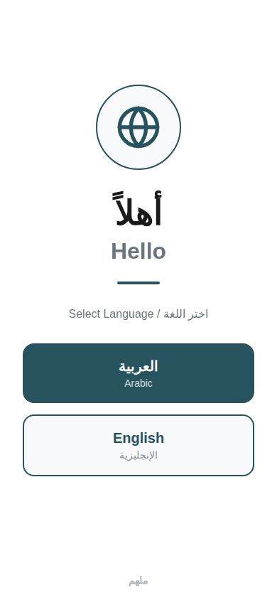
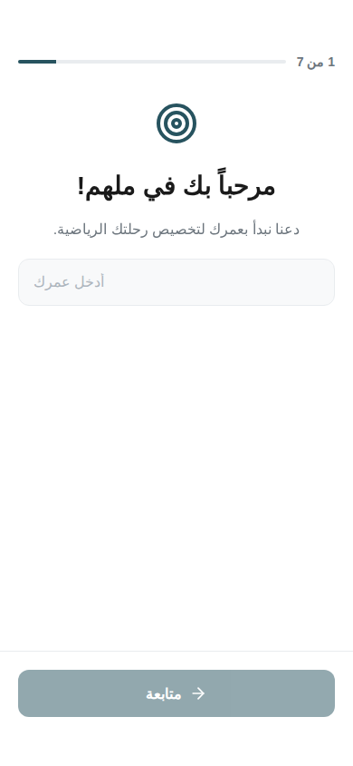
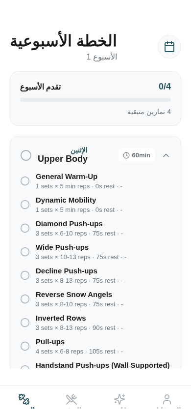
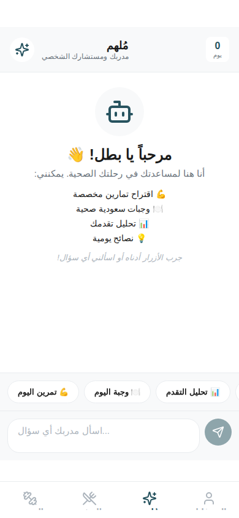
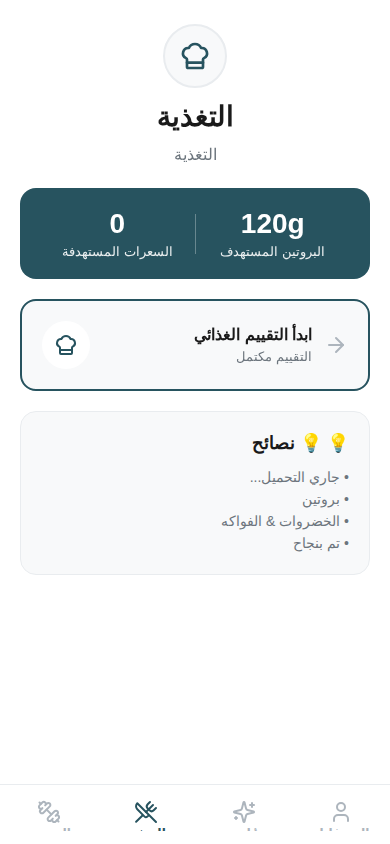
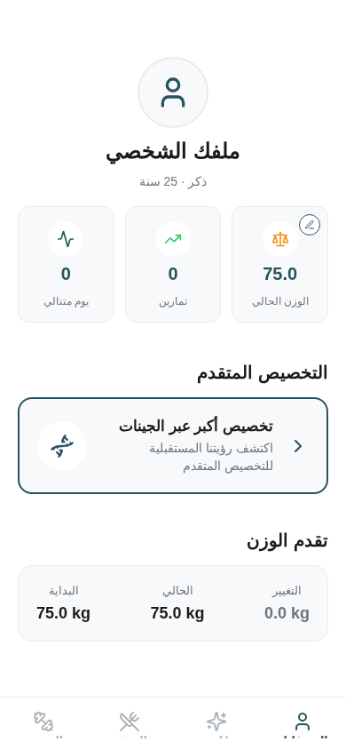

# توثيق تطبيق ملهم (Mulhim)

مرحباً بك في توثيق **ملهم**، تطبيق اللياقة البدنية والتغذية الأصيل لجميع المنصات، والمبني باستخدام React Native و Expo و Supabase و Rork AI.

## المعمارية البرمجية

يتبع التطبيق معمارية برمجية معيارية ومنظمة تحت مجلد `src/`:

- `src/api`: عملاء واجهة البرمجيات لـ Supabase و tRPC.
- `src/components`: مكونات واجهة المستخدم القابلة لإعادة الاستخدام.
  - `common/`: عناصر الواجهة الأساسية.
  - `plan/`: مكونات خاصة بشاشة خطة التمرين.
  - `coach/`: مكونات التفاعل مع المدرب الذكي.
- `src/constants`: تعريفات السمة (Theme)، الألوان، والثوابت العالمية.
- `src/context`: مزودو سياق React للحالة العالمية (الهوية، اللياقة، اللغة).
- `src/hooks`: خطافات React مخصصة للمنطق المشترك.
- `src/services`: منطق الأعمال ومغلفات الخدمات الخارجية.
- `src/types`: تعريفات أنواع TypeScript.
- `src/utils`: الوظائف المساعدة والأدوات.
- `src/data`: مجموعات البيانات الثابتة (قاعدة بيانات التمارين، القوالب).
- `src/backend`: خلفية Hono محلية لـ tRPC.

## التقنيات المستخدمة

- **الواجهة الأمامية**: React Native مع Expo Router.
- **إدارة الحالة**: React Context API.
- **الخلفية/API**: Hono مع tRPC.
- **قاعدة البيانات**: Supabase.
- **الذكاء الاصطناعي**: Rork AI SDK للمدرب الذكي والاقتراحات الذكية.

## التثبيت والتشغيل

1. **استنساخ المستودع**.
2. **تثبيت الاعتمادات**:
   ```bash
   bun install
   ```
3. **إعداد متغيرات البيئة**:
   قم بإنشاء ملف `.env` في الجذر وأضف المتغيرات المطلوبة.
4. **تشغيل التطبيق**:
   ```bash
   npm run start
   ```

## تدفق التطبيق

1. **التهيئة (Onboarding)**: يدخل المستخدم بياناته البدنية، أهدافه، وتفضيلات التمرين.
2. **خطة التمرين**: يقوم الذكاء الاصطناعي بإنشاء خطة أسبوعية مخصصة بناءً على مستوى المستخدم والأدوات المتاحة.
3. **المدرب الذكي**: واجهة دردشة حيث يمكن للمستخدم طلب اقتراحات وجبات، نصائح تمرين، أو تحليل للتقدم.
4. **التغذية**: خطط وجبات مخصصة وتتبع للعناصر الغذائية الكبرى (Macros).
5. **الملف الشخصي**: إدارة المعلومات الشخصية ومقاييس اللياقة.

## تعمق: المدرب الذكي (Rork AI)

يعمل المدرب الذكي بواسطة **Rork AI SDK**، مما يوفر واجهة محادثة قادرة على تنفيذ إجراءات داخل التطبيق من خلال "الأدوات" (Tools).

### التنفيذ التقني
- **المكتبة**: `@rork-ai/toolkit-sdk`
- **الخطاف (Hook)**: `useRorkAgent`
- **المميزات**:
  - **وعي بالسياق**: يمتلك الوكيل حق الوصول إلى الملف البدني للمستخدم وأهدافه.
  - **استخدام الأدوات**: يمكن للوكيل استدعاء وظائف محددة للتفاعل مع حالة التطبيق.

### الأدوات المعرفة
1. **`suggestWorkout`**:
   - **الغرض**: التوصية بتمارين أو تعديل الخطة الحالية.
   - **المخرجات**: تعيد بيانات تمارين مهيكلة يمكن حفظها مباشرة.
2. **`suggestMeal`**:
   - **الغرض**: اقتراح وجبات صحية (مع التركيز على الأطباق السعودية التقليدية).
   - **المخرجات**: تعيد معلومات غذائية (سعرات، بروتين، مكونات).
3. **`trackProgress`**:
   - **الغرض**: تحليل اتجاهات الوزن أو القوة البدنية للمستخدم.

## تعمق: إدارة التغذية

يتميز "ملهم" بمحرك تغذية شامل يقوم بإنشاء وإدارة خطط وجبات مخصصة.

### خوارزمية إنشاء خطة الوجبات
1. **حساب السعرات**:
   - استخدام معادلة **Mifflin-St Jeor** لحساب معدل الأيض الأساسي (BMR).
   - ضرب BMR في عامل النشاط (TDEE).
   - تعديل TDEE بناءً على الهدف (مثلاً: نقص 500 سعرة لإنقاص الوزن).
2. **توزيع المغذيات الكبرى (Macros)**:
   - **البروتين**: يحسب لكل كيلوغرام من وزن الجسم (1.6جم - 2.2جم حسب الهدف).
   - **الكربوهيدرات والدهون**: يتم موازنتها بناءً على نمط النظام الغذائي المختار.
3. **اختيار الوجبات**:
   - يتم السحب من `src/data/meals.ts` (مجموعة بيانات تركز على الأطباق السعودية).
   - التصفية بناءً على استبيان تكرار الطعام (FFQ).
   - تغيير حجم الوجبات (السعرات/الماكروز) نسبياً لتناسب الهدف اليومي للمستخدم.

### منطق قائمة التسوق
يستخرج التطبيق تلقائياً جميع المكونات من خطة الوجبات الأسبوعية النشطة، ويصنفها حسب الفئة (بروتين، كربوهيدرات، خضروات، إلخ)، ويولد قائمة تسوق قابلة للتأشير.

## معرض الصور

| الترحيب | التهيئة | خطة التمرين |
| :---: | :---: | :---: |
|  |  |  |

| المدرب الذكي | التغذية | الملف الشخصي |
| :---: | :---: | :---: |
|  |  |  |
