# App Screenshots

This directory contains screenshots of all major screens in the Mulhim (مُلهم) fitness app, captured from the web build.

## Screen Flow

### 1. Welcome Screen
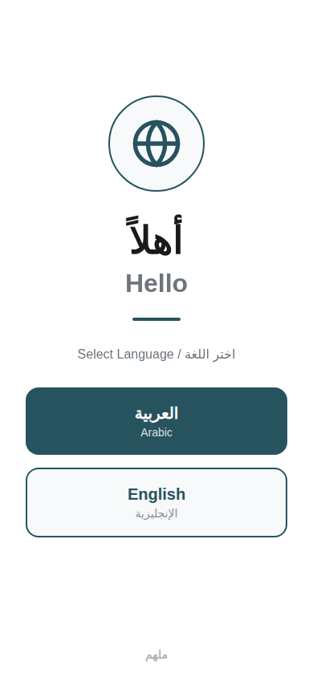
- Language selection (Arabic / English)
- First screen shown on app launch

### 2. Account Prompt
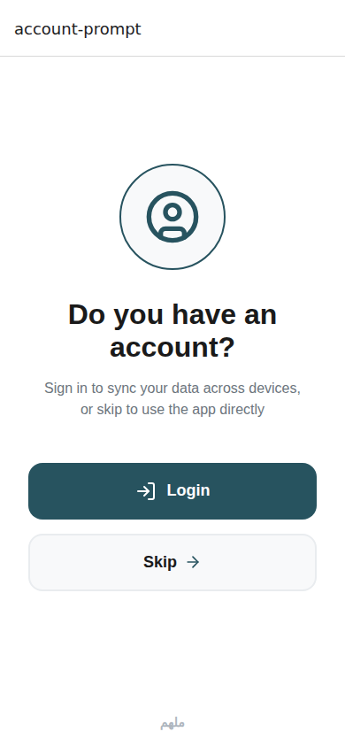
- Login or Skip options
- Shown after language selection

### 3. Login Screen
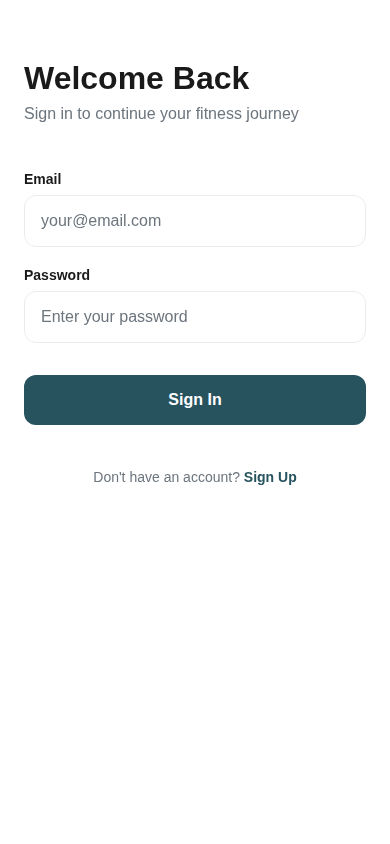
- Email/password authentication
- Link to sign up

### 4. Sign Up Screen
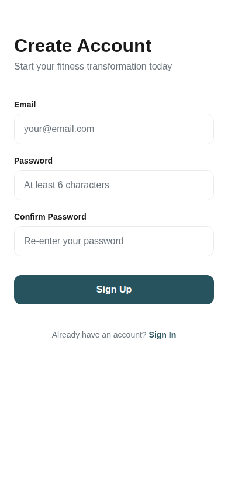
- Create new account with email/password
- Password confirmation

### 5. Onboarding - Step 1 (Age)
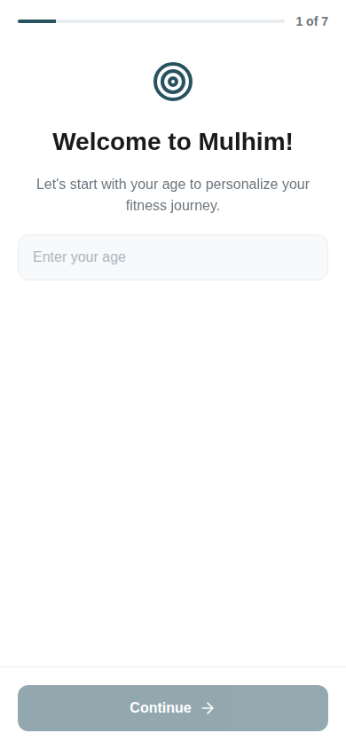
- Enter age to personalize fitness journey

### 6. Onboarding - Step 2 (Measurements)
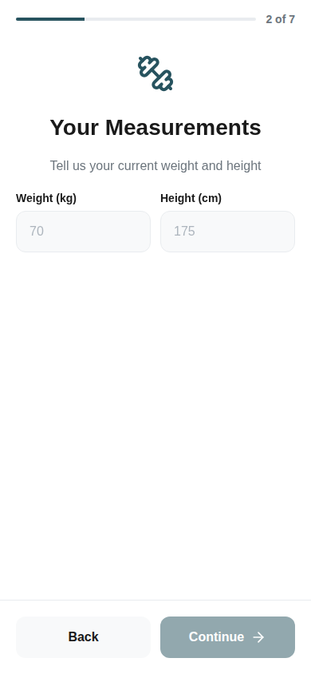
- Weight (kg) and Height (cm) input

### 7. Onboarding - Step 3 (Gender)
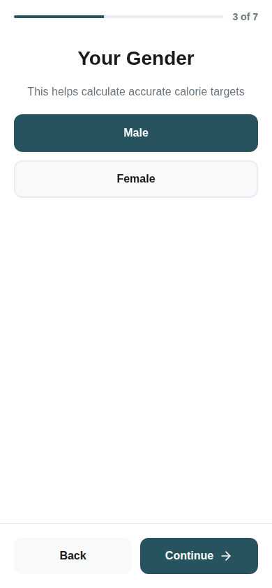
- Gender selection (Male/Female)

### 8. Onboarding - Step 4 (Goal)

- Fitness goal: Fat Loss, Muscle Gain, or General Fitness

### 9. Onboarding - Step 5 (Activity Level)
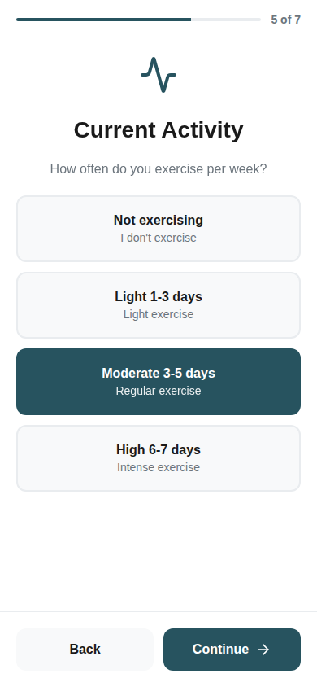
- Current activity level selection

### 10. Onboarding - Step 6 (Training Location)
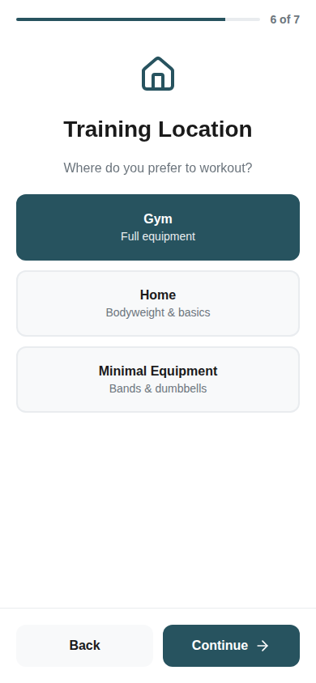
- Training location: Gym, Home, or Minimal Equipment

### 11. Onboarding - Step 7 (Schedule)
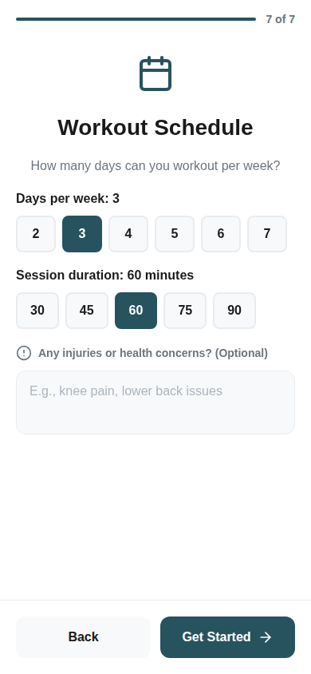
- Days per week and session duration
- Optional injury/health notes

### 12. Plan Tab (Workout Plan)
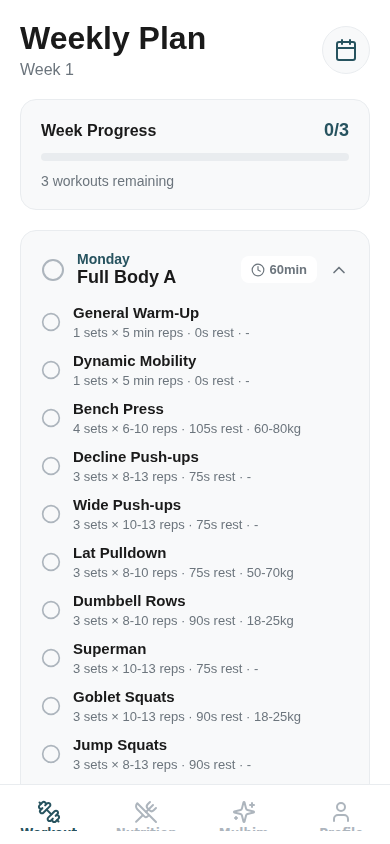
- AI-generated weekly workout plan
- Exercise details with sets, reps, rest, weights
- Session completion tracking

### 13. Nutrition Tab
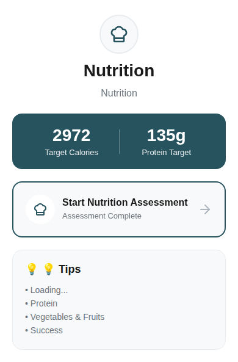
- Target calories and protein
- Nutrition assessment
- Tips section

### 14. Coach Tab (Mulhim AI)
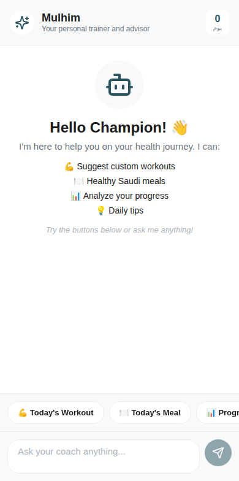
- AI fitness coach interface
- Quick action buttons
- Chat-style interaction

### 15. Profile Tab
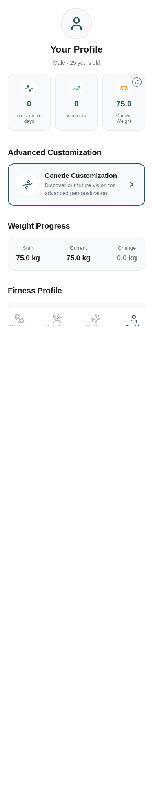
- User profile summary
- Body metrics (BMI, BMR, TDEE)
- Weight progress tracking
- Fitness profile details
- Account settings
